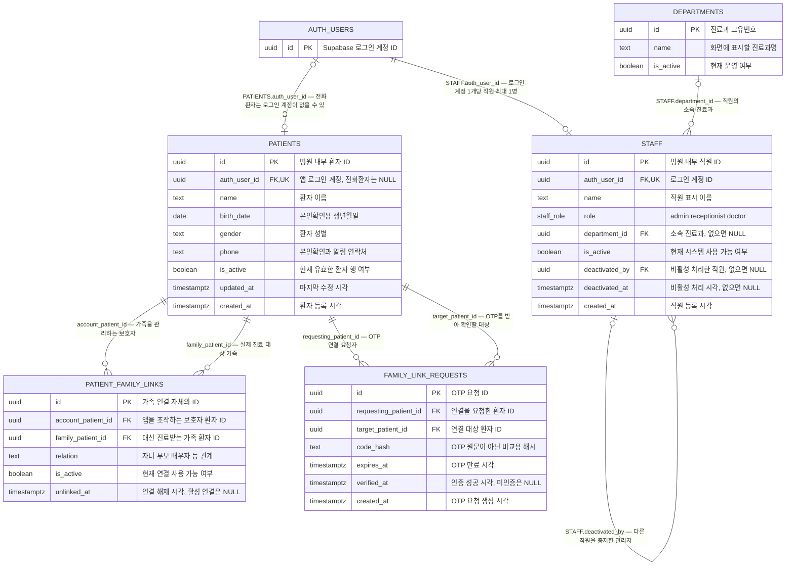
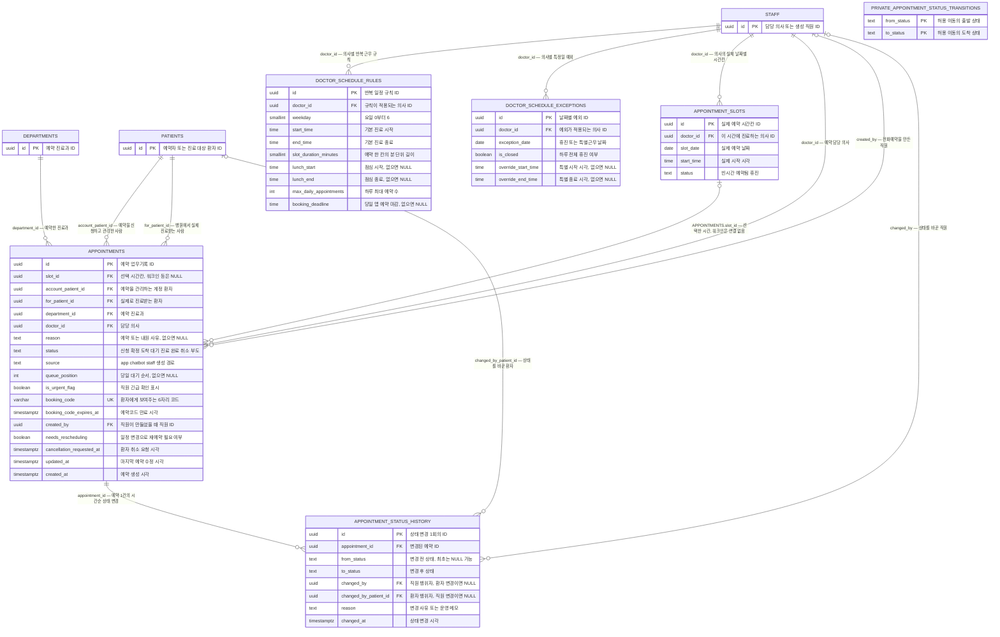
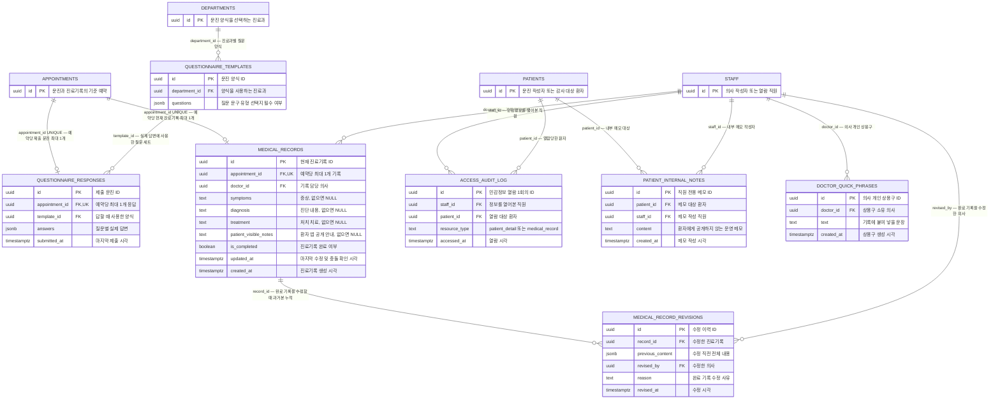
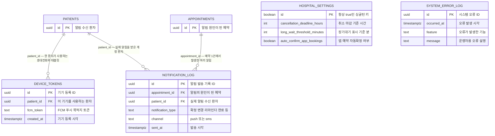
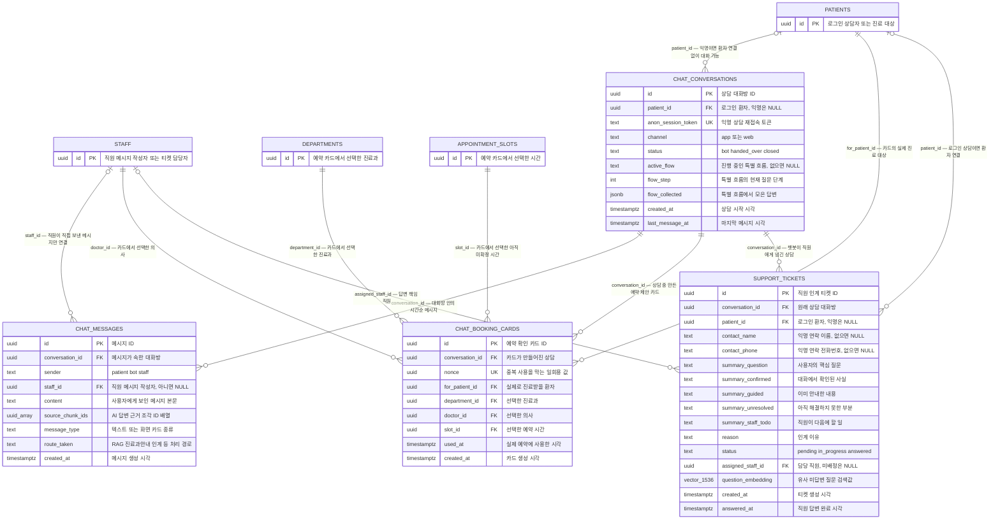
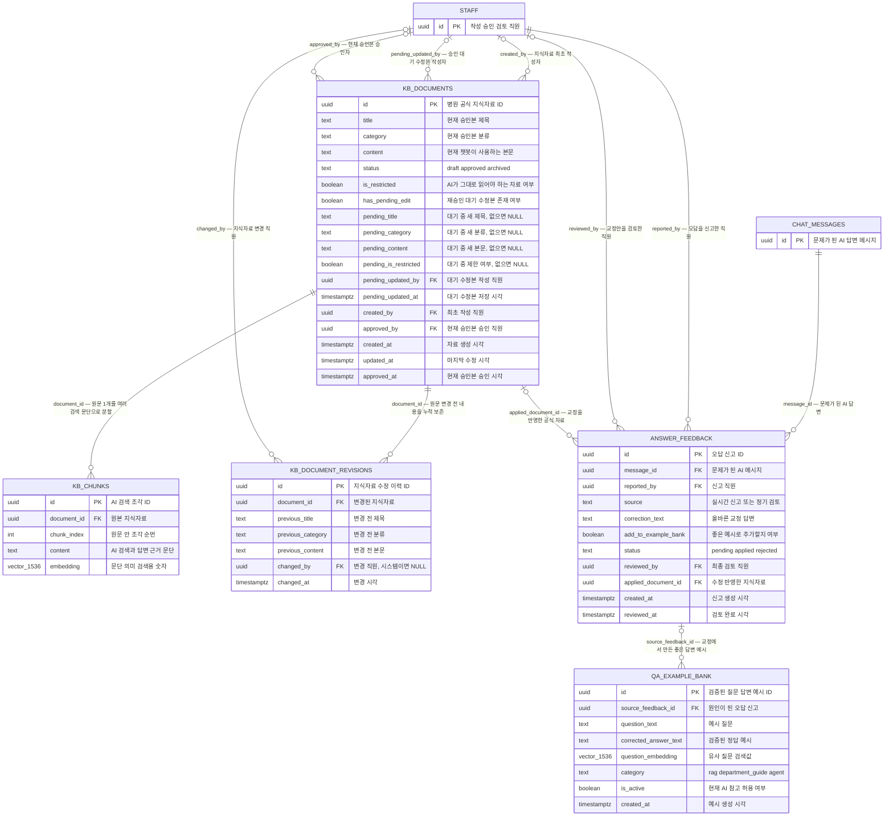

# 병원 시스템 데이터 지도 — 비개발자용 ERD와 컬럼 설명서

작성일: 2026-07-28  
대상: 기획자, 병원 운영자, 디자이너, 비개발자 검토자  
기술 기준: Supabase/PostgreSQL  
전문가용 원본: `docs/supabase-planned-erd-2026-07-28.md`  
보안·정합성 검토: `docs/supabase-postgres-review-2026-07-28.md`

## 1. 이 문서가 답하려는 질문

이 문서는 전문 ERD를 단순한 쉬운 그림으로 바꾸는 문서가 아니다. 실제 테이블명·컬럼명과 `PK`, `FK`, `UNIQUE`, 관계 개수 기호를 그대로 보여주고, 그 옆에 비개발자가 해석할 수 있는 한글 주석을 붙인 **해설형 ERD**다.

문서는 다음 순서로 읽으면 된다.

1. 2장에서 ERD에 반복해서 나오는 전문용어를 확인한다.
2. 3장의 주석형 ERD에서 관심 있는 업무 흐름과 연결 컬럼을 찾는다.
3. 5~7장에서 같은 테이블의 모든 컬럼이 어느 화면과 시점에 쓰이는지 자세히 확인한다.
4. 8장에서 실제 예약·진료·챗봇 업무 한 건이 여러 테이블을 지나가는 순서를 확인한다.

이 방식으로 다음과 같은 실제 질문에 답한다.

- 환자 한 명의 정보는 어디에 저장되는가?
- 보호자가 가족 대신 예약하면 두 사람은 어떻게 구분되는가?
- 예약시간, 실제 예약, 예약 상태 변경 기록은 왜 서로 다른 곳에 저장되는가?
- 의사가 작성한 진료기록을 수정하면 이전 내용은 어디에 남는가?
- 챗봇이 어떤 자료를 근거로 답했는지 확인할 수 있는가?
- 직원이 민감한 환자정보를 열어본 사실은 어디에 기록되는가?
- 각 컬럼(column, 표의 세로 항목)은 어느 화면이나 업무에서 사용되는가?

이 문서는 아직 실제로 만들어진 데이터베이스가 아니라 **현재 구현 계획에 적힌 예정 구조**를 설명한다. 보안 검토에서 수정이 필요하다고 판정된 부분도 있으므로, 이 문서를 “최종 확정 설계”가 아니라 “현재 설계와 수정할 지점을 함께 보여주는 지도”로 읽어야 한다.

## 2. 먼저 알아둘 쉬운 용어

| 전문용어 | 쉬운 설명 |
|---|---|
| Database(데이터베이스) | 병원 시스템이 사용하는 여러 장부를 모아 둔 저장소다. |
| Table(테이블) | 같은 종류의 정보를 모아 둔 장부 한 권이다. 예: 환자 장부, 예약 장부. |
| Row(행) | 장부 한 줄이다. `patients`의 한 행은 환자 한 명을 뜻한다. |
| Column(컬럼) | 장부의 세로 항목이다. 예: 이름, 전화번호, 생년월일. |
| `id` | 각 행을 다른 행과 구별하는 시스템 내부 고유번호다. 사람에게 보여주는 접수번호와는 다르다. |
| UUID | 추측하기 어려운 긴 형태의 고유번호다. 대부분의 `id`에 사용한다. |
| PK(Primary Key, 기본키) | 테이블 안에서 한 행을 확실히 식별하는 대표 고유번호다. |
| FK(Foreign Key, 외래키) | 다른 테이블의 행을 가리키는 연결번호다. 예: 예약의 `doctor_id`는 직원 장부의 의사를 가리킨다. |
| UK/UNIQUE(고유 제약) | 같은 값이 두 번 저장되지 못하게 하는 규칙이다. |
| Constraint(제약조건) | 잘못된 값이나 관계가 저장되지 못하게 DB가 직접 강제하는 규칙이다. PK, FK, UNIQUE, CHECK가 여기에 포함된다. |
| Relationship(관계) | 한 테이블의 FK가 다른 테이블의 PK를 가리키는 연결이다. |
| Cardinality(관계 개수) | 한 행이 반대편 테이블의 몇 행과 연결될 수 있는지 나타내는 `1:1`, `1:N` 같은 규칙이다. |
| Parent/Child table(부모/자식 테이블) | `id`를 제공하는 쪽이 부모, 그 `id`를 FK로 저장하는 쪽이 자식이다. 업무상 상하관계가 아니라 참조 방향을 뜻한다. |
| Composite key(복합키) | 컬럼 두 개 이상을 한 묶음으로 사용해 중복을 막거나 행을 식별하는 키다. |
| NULL | 아직 값이 없거나 해당되지 않아 비워 둔 상태다. 숫자 0이나 빈 문자열과는 다르다. |
| boolean | `true/false`, 즉 예/아니오만 저장하는 값이다. |
| date | 날짜만 저장한다. 예: 2026-07-28. |
| time | 하루 중 시각만 저장한다. 예: 09:30. |
| timestamptz | 날짜·시각과 시간대 기준을 함께 다루는 값이다. 생성·수정·승인 시각에 사용한다. |
| JSONB | 질문 목록처럼 모양이 자주 달라지는 묶음 데이터를 저장하는 PostgreSQL 형식이다. |
| vector(벡터) | AI가 문장의 의미가 얼마나 비슷한지 비교하기 위해 사용하는 숫자 묶음이다. |
| RLS(Row Level Security, 행 단위 보안) | 같은 테이블에서도 사용자에 따라 볼 수 있는 행을 제한하는 데이터베이스 보안 규칙이다. |
| Soft delete(소프트 삭제) | 행을 실제로 지우지 않고 `is_active=false` 또는 `archived`로 표시해 과거 기록을 보존하는 방식이다. |
| Audit log(감사로그) | 누가 언제 민감한 정보를 열거나 변경했는지 남기는 기록이다. |

## 3. 주석이 붙은 실제 ERD 읽기

이 장의 그림은 테이블 이름만 연결한 개념도가 아니라 실제 `PK`, `FK`, `UNIQUE`와 컬럼을 표시한 ERD다. 전문용어와 실제 컬럼명은 그대로 두고, 오른쪽 따옴표 안에 “무엇이며 언제 쓰는지”를 짧게 적었다. 더 긴 설명은 5~7장의 같은 테이블 항목에서 확인한다.

### 3.1 먼저 관계선 한 줄을 읽는 방법

예를 들어 다음 관계가 있다고 하자.

```text
PATIENTS ||--o{ APPOINTMENTS : "APPOINTMENTS.account_patient_id — 예약을 관리하는 환자"
```

이 한 줄은 다음처럼 읽는다.

1. `PATIENTS`가 기준 장부다.
2. `APPOINTMENTS.account_patient_id`가 FK이며 `PATIENTS.id`를 저장한다.
3. 예약 한 건에는 예약을 관리하는 환자가 반드시 한 명(`||`) 있다.
4. 환자 한 명은 예약이 없을 수도 있고 여러 건(`o{`)일 수도 있다.
5. 가족 예약이면 이 컬럼은 실제 진료 대상이 아니라 앱을 조작한 보호자를 가리킨다.

관계선 끝의 기호는 다음 뜻이다.

| 기호 | 전문적 의미 | 이 문서에서 읽는 말 |
|---|---|---|
| `||` | exactly one | 반드시 한 건 |
| `o|` | zero or one | 없거나 한 건 |
| `|{` | one or many | 한 건 이상 |
| `o{` | zero or many | 없거나 여러 건 |

관계선은 보통 “부모 테이블의 `id` ← 자식 테이블의 `*_id` FK” 방향으로 이해하면 된다. 예를 들어 `appointments.doctor_id` 값은 `staff.id` 중 하나를 복사해 저장한 연결번호다. 의사 이름 자체를 예약마다 다시 저장하는 것이 아니다.

### 3.2 로그인·직원·환자·가족 ERD



이 그림의 핵심 흐름은 `AUTH_USERS.id → PATIENTS.auth_user_id → PATIENT_FAMILY_LINKS.account_patient_id`다. 로그인한 계정에서 병원 환자 행을 찾고, 그 환자가 관리할 수 있는 가족 환자를 다시 찾는다. `account_patient_id`와 `family_patient_id`는 둘 다 `patients.id`를 가리키지만 업무 역할이 완전히 다르다.

### 3.3 의사 일정·슬롯·예약·상태 ERD



예약 가능 시간이 만들어지는 방향은 `doctor_schedule_rules + doctor_schedule_exceptions → appointment_slots`다. 이 두 화살표는 FK 관계가 아니라 계산 관계이므로 ERD 관계선으로 그리지 않았다. 반복 규칙과 날짜 예외를 계산해 생성한 결과가 슬롯이다.

실제 예약 흐름은 다음 순서로 읽는다.

1. `appointment_slots.id`를 선택한다.
2. 선택값을 `appointments.slot_id`에 넣는다.
3. 본인 예약이면 `account_patient_id = for_patient_id`다.
4. 가족 예약이면 `account_patient_id`는 보호자, `for_patient_id`는 자녀·부모 등 실제 환자다.
5. 현재 상태는 `appointments.status`, 변경 과정은 `appointment_status_history`에 누적한다.
6. `private.appointment_status_transitions`는 일반 사용자가 건드릴 수 없는 내부 규칙표이며 DB 트리거가 `from_status → to_status` 조합을 검사할 때만 읽는다.

### 3.4 문진·진료기록·감사 ERD



이 그림은 예약 하나를 중심으로 좌우를 나눠 읽으면 쉽다.

- 진료 전: `appointments.id → questionnaire_responses.appointment_id`
- 진료 중·후: `appointments.id → medical_records.appointment_id`
- 완료 기록 수정: `medical_records.id → medical_record_revisions.record_id`
- 민감정보 열람: 진료기록과 직접 FK로 연결하지 않고, “누가(`staff_id`) 어느 환자(`patient_id`)를 열었는가”를 `access_audit_log`에 별도 기록한다.

### 3.5 운영 설정·앱 알림 ERD



`hospital_settings`와 `system_error_log`는 FK가 없는 독립 테이블이다. 전자는 시스템 전체가 읽는 설정 한 행이고, 후자는 특정 환자나 예약과 연결하지 않는 장애 기록이다.

알림은 `appointments.account_patient_id`를 그대로 수신자로 단정하면 안 된다. 가족 예약 정책에 따라 실제 알림 수신자를 결정한 뒤 `notification_log.patient_id`에 그 결과를 기록하고, 해당 환자의 `device_tokens`에서 푸시 목적지를 찾는다.

### 3.6 AI 상담·예약 제안·직원 인계 ERD



`chat_booking_cards`는 실제 예약이 아니다. 선택 내용을 잠시 고정해 보여주는 확인서다. 사용자가 최종 확인하면 카드의 `slot_id`, `for_patient_id`, `department_id`, `doctor_id`를 검증해 별도의 `appointments` 행을 만든다. 따라서 카드와 예약 사이에 FK가 없는 것은 “아직 예약 전”이라는 업무 단계를 뜻한다.

### 3.7 AI 지식자료·근거·오답개선 ERD



AI 답변의 정상 흐름은 `kb_documents.id → kb_chunks.document_id → AI 검색 → chat_messages.source_chunk_ids`다. 마지막 연결은 UUID 배열이라 정식 FK가 아니다. 즉, 그림에는 업무상 연결로 설명하지만 PostgreSQL이 각 배열 값을 `kb_chunks.id`로 강제하지는 못한다.

오답 개선 흐름은 `chat_messages.id → answer_feedback.message_id → qa_example_bank.source_feedback_id`다. 교정이 공식 안내자료 변경으로 이어지면 `answer_feedback.applied_document_id`도 `kb_documents.id`를 가리킨다.

## 4. 가장 중요한 구분 세 가지

### 4.1 로그인 계정과 환자는 같은 것이 아니다

`auth.users`는 Supabase가 관리하는 로그인 계정이다. `patients`는 병원이 관리하는 환자정보다. 과거에 전화로 예약한 환자는 병원 장부에는 있지만 아직 앱 계정은 없을 수 있으므로 두 정보를 분리한다.

### 4.2 예약시간과 예약은 같은 것이 아니다

`appointment_slots`는 “김의사, 7월 28일 10시가 비어 있음”이라는 시간표다. `appointments`는 “홍길동 환자가 그 시간을 예약함”이라는 업무 기록이다. 시간을 옮기거나 예약을 취소할 때 두 장부가 함께 맞아야 한다.

### 4.3 현재 값과 변경 이력은 같은 것이 아니다

`appointments`와 `medical_records`에는 현재 상태가 들어간다. `appointment_status_history`와 `medical_record_revisions`에는 누가 무엇을 바꿨는지 과거 내용이 들어간다. 의료·예약 업무에서는 현재 값만큼 과거 기록도 중요하다.

---

# 5. 직원·환자·예약·진료 데이터

## 5.1 `departments` — 진료과 장부

**무엇을 저장하나:** 내과, 정형외과처럼 병원이 운영하는 진료과를 한 줄씩 저장한다.

**언제 사용하나:** 직원 등록, 의사 검색, 예약 생성, 문진 양식 선택, 챗봇의 진료과 안내에서 사용한다.

**다른 데이터와의 관계:** 한 진료과에는 여러 직원·예약·문진 양식이 연결될 수 있다.

| 컬럼 | 쉬운 뜻과 사용 시점 |
|---|---|
| `id` (`uuid`, PK) | 진료과의 내부 고유번호다. 직원이나 예약이 어느 진료과인지 연결할 때 사용한다. |
| `name` (`text`) | 화면에 표시할 진료과 이름이다. 예: “내과”. |
| `is_active` (`boolean`) | 현재 예약을 받을 수 있는 진료과인지 표시한다. 폐과하거나 잠시 사용하지 않을 때 행을 지우지 않고 `false`로 바꾼다. |

## 5.2 `staff` — 병원 직원 장부

**무엇을 저장하나:** 관리자, 접수직원, 의사의 기본정보와 로그인 연결 상태를 저장한다.

**언제 사용하나:** 직원 로그인, 권한 확인, 담당 의사 표시, 환자정보 열람, 기록 작성자 확인에 사용한다.

**다른 데이터와의 관계:** 직원은 진료과에 속할 수 있고, 의사라면 일정·예약·진료기록과 연결된다. 한 직원을 비활성 처리한 다른 직원도 기록한다.

| 컬럼 | 쉬운 뜻과 사용 시점 |
|---|---|
| `id` (`uuid`, PK) | 직원의 병원 내부 고유번호다. 예약의 담당 의사나 기록 작성자를 가리킬 때 사용한다. |
| `auth_user_id` (`uuid`, FK, UNIQUE) | Supabase 로그인 계정 `auth.users`와 직원을 연결한다. 로그인한 사람이 어느 직원인지 찾을 때 사용한다. |
| `name` (`text`) | 직원 또는 의사의 표시 이름이다. |
| `role` (`staff_role`) | 직원 역할이다. 계획상 관리자, 접수직원, 의사처럼 권한을 나누는 데 사용한다. |
| `department_id` (`uuid`, FK, NULL 가능) | 소속 진료과의 `departments.id`다. 진료과 소속이 없는 관리자는 비어 있을 수 있다. |
| `is_active` (`boolean`) | 현재 근무하며 시스템을 사용할 수 있는지 표시한다. 퇴사·정지 시 `false`로 바꾼다. |
| `deactivated_by` (`uuid`, FK, NULL 가능) | 이 직원을 비활성 처리한 다른 직원의 `staff.id`다. 누가 사용을 중지했는지 확인한다. |
| `deactivated_at` (`timestamptz`, NULL 가능) | 비활성 처리한 시각이다. 활성 직원이라면 비어 있다. |
| `created_at` (`timestamptz`) | 직원 행을 처음 등록한 시각이다. |

> 검토 주의: 환자에게 보여줄 의사 목록은 `role='doctor'`뿐 아니라 `is_active=true`도 확인해야 한다.

## 5.3 `doctor_schedule_rules` — 의사의 반복 근무시간 규칙

**무엇을 저장하나:** “김의사는 매주 월요일 09:00~17:00 진료”처럼 반복되는 기본 시간표를 저장한다.

**언제 사용하나:** 관리자가 의사 근무시간을 설정하고 시스템이 향후 예약 가능 시간(`appointment_slots`)을 만들 때 사용한다.

**다른 데이터와의 관계:** 각 규칙은 한 의사인 `staff`와 연결된다. 의사 한 명은 요일별 규칙을 여러 개 가질 수 있다.

| 컬럼 | 쉬운 뜻과 사용 시점 |
|---|---|
| `id` (`uuid`, PK) | 일정 규칙의 내부 고유번호다. |
| `doctor_id` (`uuid`, FK) | 이 규칙이 적용되는 의사의 `staff.id`다. |
| `weekday` (`smallint`) | 요일을 0~6 숫자로 저장한다. 화면에서는 월·화·수처럼 바꿔 보여준다. |
| `start_time` (`time`) | 기본 진료 시작 시각이다. |
| `end_time` (`time`) | 기본 진료 종료 시각이다. |
| `slot_duration_minutes` (`smallint`) | 예약 한 칸의 길이다. 예: 30이면 30분 간격 슬롯을 만든다. |
| `lunch_start` (`time`, NULL 가능) | 점심시간 시작이다. 점심시간을 사용하지 않으면 비워 둔다. |
| `lunch_end` (`time`, NULL 가능) | 점심시간 종료다. |
| `max_daily_appointments` (`int`) | 해당 의사가 하루에 받을 수 있는 최대 예약 수다. |
| `booking_deadline` (`time`, NULL 가능) | 당일 예약을 언제까지 받을지 나타내는 마감시각이다. |

> 검토 주의: 같은 의사·요일 규칙의 중복 방지와 시작시각이 종료시각보다 이른지 확인하는 DB 제약을 추가해야 한다.

## 5.4 `doctor_schedule_exceptions` — 특정 날짜의 일정 예외

**무엇을 저장하나:** 공휴일 휴진이나 특정 날짜의 단축진료처럼 반복 일정에서 벗어나는 예외를 저장한다.

**언제 사용하나:** 슬롯 생성 전에 기본 근무시간을 그대로 쓸지, 휴진할지, 특별 시간을 쓸지 결정할 때 사용한다.

**다른 데이터와의 관계:** 각 예외는 한 의사와 한 날짜에 연결된다. 같은 의사·날짜에는 하나만 저장된다.

| 컬럼 | 쉬운 뜻과 사용 시점 |
|---|---|
| `id` (`uuid`, PK) | 일정 예외의 내부 고유번호다. |
| `doctor_id` (`uuid`, FK) | 예외가 적용되는 의사의 `staff.id`다. |
| `exception_date` (`date`) | 예외가 적용되는 실제 날짜다. |
| `is_closed` (`boolean`) | 하루 전체가 휴진인지 표시한다. `true`면 해당 날짜에 슬롯을 만들지 않는다. |
| `override_start_time` (`time`, NULL 가능) | 휴진이 아니라 특별 근무라면 그날의 시작시각을 저장한다. |
| `override_end_time` (`time`, NULL 가능) | 특별 근무 종료시각이다. |
| `UNIQUE (doctor_id, exception_date)` | 컬럼이 아니라 중복방지 규칙이다. 한 의사의 같은 날짜 예외가 두 번 생기는 것을 막는다. |

## 5.5 `patients` — 환자 기본정보 장부

**무엇을 저장하나:** 병원에서 진료받는 사람의 이름, 생년월일, 연락처와 앱 로그인 연결을 저장한다.

**언제 사용하나:** 접수, 예약, 가족 연결, 알림, 진료기록 조회, 환자 앱 프로필에서 사용한다.

**다른 데이터와의 관계:** 한 환자는 여러 예약과 알림을 가질 수 있다. 본인 계정으로 가족 환자를 관리할 수도 있다.

| 컬럼 | 쉬운 뜻과 사용 시점 |
|---|---|
| `id` (`uuid`, PK) | 환자의 병원 내부 고유번호다. 동명이인을 구분하고 모든 의료·예약 기록을 연결한다. |
| `auth_user_id` (`uuid`, FK, UNIQUE, NULL 가능) | 환자의 Supabase 로그인 계정이다. 전화 접수로만 등록되어 아직 앱 계정이 없으면 비어 있을 수 있다. |
| `name` (`text`) | 환자 이름이다. 접수 확인과 화면 표시에 사용한다. |
| `birth_date` (`date`) | 생년월일이다. 본인확인과 동명이인 구분에 사용한다. |
| `gender` (`text`) | 성별 값이다. 환자 프로필과 진료 참고정보에 사용한다. |
| `phone` (`text`) | 연락처다. 본인확인, 예약 안내, 가족 연결 OTP 전송에 사용한다. |
| `is_active` (`boolean`) | 현재 이 환자 계정과 기록을 정상 사용하게 할지 표시한다. 병합·이용중지 시 `false`가 될 수 있다. |
| `updated_at` (`timestamptz`) | 환자정보를 마지막으로 수정한 시각이다. |
| `created_at` (`timestamptz`) | 환자 장부에 처음 등록한 시각이다. |

> 검토 주의: 환자가 직접 `auth_user_id`나 `is_active`를 바꾸지 못하도록 프로필 수정 범위를 제한해야 한다.

## 5.6 `patient_family_links` — 가족 대신 이용하는 권한 연결

**무엇을 저장하나:** 앱 계정을 가진 환자가 자녀·부모 등 다른 환자의 예약과 기록을 관리할 수 있는 관계를 저장한다.

**언제 사용하나:** 보호자가 가족 대신 예약하거나 가족의 방문이력을 볼 수 있는지 확인할 때 사용한다.

**다른 데이터와의 관계:** `account_patient_id`와 `family_patient_id`가 모두 `patients`를 가리키지만 역할이 다르다.

| 컬럼 | 쉬운 뜻과 사용 시점 |
|---|---|
| `id` (`uuid`, PK) | 가족 연결 자체의 고유번호다. |
| `account_patient_id` (`uuid`, FK) | 앱을 조작하고 가족을 관리하는 계정 쪽 환자의 `patients.id`다. |
| `family_patient_id` (`uuid`, FK) | 대신 예약하거나 조회할 진료 대상 가족의 `patients.id`다. |
| `relation` (`text`) | 두 사람의 관계다. 예: 자녀, 부모, 배우자. |
| `is_active` (`boolean`) | 현재 연결이 유효한지 표시한다. 연결 해제 시 행을 지우지 않고 `false`로 바꾼다. |
| `unlinked_at` (`timestamptz`, NULL 가능) | 가족 연결을 해제한 시각이다. 활성 연결이면 비어 있다. |
| `UNIQUE (account_patient_id, family_patient_id)` | 같은 두 사람의 연결을 중복 저장하지 못하게 하는 규칙이다. |

> 검토 주의: 자기 자신을 가족으로 연결하지 못하게 해야 하며, 환자가 대상 ID나 활성 상태를 직접 바꿔 OTP 확인을 우회하지 못하게 해야 한다.

## 5.7 `appointment_slots` — 의사별 예약 가능 시간표

**무엇을 저장하나:** 의사의 실제 날짜별 예약 칸을 저장한다. 예: 김의사, 7월 28일, 10:00, 빈시간.

**언제 사용하나:** 환자가 가능한 시간을 검색하고 예약이 성공하면 해당 시간을 “예약됨”으로 바꿀 때 사용한다.

**다른 데이터와의 관계:** 한 슬롯은 한 의사와 연결된다. 슬롯이 예약되면 `appointments.slot_id`가 이 행을 가리킨다.

| 컬럼 | 쉬운 뜻과 사용 시점 |
|---|---|
| `id` (`uuid`, PK) | 시간 칸의 내부 고유번호다. 예약이 어느 시간을 선택했는지 연결한다. |
| `doctor_id` (`uuid`, FK) | 해당 시간에 진료하는 의사의 `staff.id`다. |
| `slot_date` (`date`) | 예약 가능한 날짜다. |
| `start_time` (`time`) | 예약 시작시각이다. |
| `status` (`text`) | 현재 상태다. 계획상 `빈시간`, `예약됨`, `휴진` 중 하나다. |
| `UNIQUE (doctor_id, slot_date, start_time)` | 같은 의사의 같은 날짜·시각이 두 번 생기는 것을 막는다. |

> 검토 주의: 환자가 테이블을 직접 수정하지 못하게 하고, 예약 RPC가 슬롯 점유와 예약 생성을 한 번에 처리해야 한다.

## 5.8 `appointments` — 실제 예약 장부

**무엇을 저장하나:** 누가 누구를 위해 어느 진료과·의사·시간을 예약했는지와 현재 진행 상태를 저장한다.

**언제 사용하나:** 예약 신청, 접수 확인, 당일 대기열, 진료 시작·완료, 취소, 방문이력의 중심 데이터로 사용한다.

**다른 데이터와의 관계:** 환자 두 역할, 진료과, 의사, 선택 슬롯, 예약을 만든 직원과 연결된다. 상태 이력·문진·진료기록·알림이 이 예약을 기준으로 이어진다.

| 컬럼 | 쉬운 뜻과 사용 시점 |
|---|---|
| `id` (`uuid`, PK) | 예약의 내부 고유번호다. 문진·진료기록·알림을 같은 예약에 연결한다. |
| `slot_id` (`uuid`, FK, NULL 가능) | 선택한 `appointment_slots.id`다. 아직 시간을 정하지 않은 예약은 비어 있을 수 있다. |
| `account_patient_id` (`uuid`, FK) | 예약을 신청하고 관리하는 계정 환자다. 가족 대신 예약하면 보호자 쪽이다. |
| `for_patient_id` (`uuid`, FK) | 실제 진료받는 환자다. 본인 예약이면 위 계정 환자와 같다. |
| `department_id` (`uuid`, FK) | 예약한 진료과의 `departments.id`다. |
| `doctor_id` (`uuid`, FK) | 담당 의사의 `staff.id`다. |
| `reason` (`text`, NULL 가능) | 환자나 직원이 적은 예약·내원 사유다. |
| `status` (`text`) | 현재 예약 단계다. `예약신청`, `예약확정`, `도착`, `진료대기`, `진료중`, `진료완료`, 각종 취소·부도 상태를 사용한다. |
| `source` (`text`) | 예약이 만들어진 경로다. `app`, `chatbot`, `staff` 중 하나다. |
| `queue_position` (`int`, NULL 가능) | 당일 대기 순서다. 대기열에 들어가기 전에는 비어 있을 수 있다. |
| `is_urgent_flag` (`boolean`) | 직원 화면에서 긴급 확인이 필요한 예약인지 표시한다. 의료적 확정 진단을 뜻하지는 않는다. |
| `booking_code` (`varchar(6)`, UNIQUE, NULL 가능) | 환자에게 보여줄 짧은 예약 확인번호다. 내부 UUID 대신 안내에 사용한다. |
| `booking_code_expires_at` (`timestamptz`, NULL 가능) | 예약 확인번호를 더 이상 사용할 수 없게 되는 시각이다. |
| `created_by` (`uuid`, FK, NULL 가능) | 직원이 만든 예약이면 그 직원의 `staff.id`다. 환자·챗봇 예약이면 비어 있을 수 있다. |
| `needs_rescheduling` (`boolean`) | 의사 일정 변경 등으로 새 시간을 정해야 하는 예약인지 표시한다. 직원 웹 계획에서 추가된다. |
| `cancellation_requested_at` (`timestamptz`, NULL 가능) | 환자가 취소를 요청한 시각이다. 취소 요청이 없으면 비어 있다. |
| `updated_at` (`timestamptz`) | 예약을 마지막으로 변경한 시각이다. |
| `created_at` (`timestamptz`) | 예약을 처음 만든 시각이다. |

> 검토 주의: 환자가 직접 초기 상태·의사·슬롯 등을 정하지 못하도록 예약 생성·변경·취소 전용 RPC가 필요하다.

## 5.9 `appointment_status_history` — 예약 상태 변경 이력

**무엇을 저장하나:** 예약 상태가 언제, 누구에 의해, 어떤 이유로 바뀌었는지 한 번의 변경마다 새 행으로 저장한다.

**언제 사용하나:** 취소 분쟁, 운영 감사, 예약 진행과정 표시, 문제 원인 확인에 사용한다.

**다른 데이터와의 관계:** 한 예약에는 상태 변경 이력이 여러 개 생긴다. 변경자는 직원 또는 환자가 될 수 있다.

| 컬럼 | 쉬운 뜻과 사용 시점 |
|---|---|
| `id` (`uuid`, PK) | 상태 변경 한 건의 고유번호다. |
| `appointment_id` (`uuid`, FK) | 어떤 예약의 변경인지 나타내는 `appointments.id`다. |
| `from_status` (`text`, NULL 가능) | 변경 전 상태다. 예약 생성 직후 첫 기록이라면 이전 상태가 없어 비어 있을 수 있다. |
| `to_status` (`text`) | 변경 후 상태다. |
| `changed_by` (`uuid`, FK, NULL 가능) | 직원이 바꿨다면 그 직원의 `staff.id`다. 환자 변경을 지원하면서 NULL 가능으로 바뀐다. |
| `changed_by_patient_id` (`uuid`, FK, NULL 가능) | 환자가 바꿨다면 그 환자의 `patients.id`다. |
| `reason` (`text`, NULL 가능) | 취소·변경 사유나 운영 메모다. |
| `changed_at` (`timestamptz`) | 상태가 변경된 시각이다. |

> 검토 주의: 직원과 환자가 동시에 기록되거나 아무도 기록되지 않는 모순을 막고, 자동 작업에는 `system` 행위자를 남기는 구조가 필요하다.

## 5.10 `private.appointment_status_transitions` — 허용된 예약 상태 이동 규칙표

**무엇을 저장하나:** “예약확정에서 도착으로는 바꿀 수 있음”처럼 허용된 상태 변경 조합을 저장한다.

**언제 사용하나:** 예약 상태를 바꾸기 직전에 데이터베이스가 허용된 순서인지 검사할 때 사용한다.

**다른 데이터와의 관계:** 직접 FK로 연결되지는 않지만 예약 상태 변경 트리거가 이 규칙표를 읽는다.

| 컬럼 | 쉬운 뜻과 사용 시점 |
|---|---|
| `from_status` (`text`, NOT NULL, 복합 PK 일부) | 출발 상태다. 예약 생성의 최초 상태는 이 표에 NULL 행으로 넣지 않고 별도 생성 흐름에서 처리한다. |
| `to_status` (`text`, 복합 PK 일부) | 도착 상태다. |
| `PK (from_status, to_status)` | 같은 상태 이동 규칙이 중복 저장되지 않게 한다. |

> 반영 완료: 초기 검토의 NULL 기본키 문제와 공개 권한 문제는 현재 계획에서 해결됐다. 이 표는 `private` 스키마에 두고 일반 사용자에게 표 권한을 주지 않으며, `SECURITY DEFINER` 상태전이 트리거만 읽는다.

## 5.11 `medical_records` — 현재 진료기록

**무엇을 저장하나:** 한 예약에서 의사가 작성한 현재 증상·진단·치료·환자 공개 메모를 저장한다.

**언제 사용하나:** 진료 중 기록 작성, 진료 완료, 환자 방문이력, 의료진의 과거 기록 조회에 사용한다.

**다른 데이터와의 관계:** 예약 하나당 진료기록은 최대 하나다. 담당 의사와 연결되고, 수정하면 별도 수정 이력이 생긴다.

| 컬럼 | 쉬운 뜻과 사용 시점 |
|---|---|
| `id` (`uuid`, PK) | 진료기록의 내부 고유번호다. |
| `appointment_id` (`uuid`, FK, UNIQUE) | 이 기록이 속한 예약의 `appointments.id`다. UNIQUE라 예약 하나에 기록 하나만 허용한다. |
| `doctor_id` (`uuid`, FK) | 기록을 담당하는 의사의 `staff.id`다. 예약 담당 의사와 같아야 한다. |
| `symptoms` (`text`, NULL 가능) | 환자가 호소하거나 의료진이 확인한 증상이다. |
| `diagnosis` (`text`, NULL 가능) | 의사가 기록한 진단 내용이다. |
| `treatment` (`text`, NULL 가능) | 처치·치료 내용이다. |
| `patient_visible_notes` (`text`, NULL 가능) | 환자 앱에서 보여줘도 되는 별도 안내문이다. 의료진 전용 내용과 구분한다. |
| `is_completed` (`boolean`) | 진료기록 작성이 완료됐는지 표시한다. 완료 후 수정은 별도 사유와 이력이 필요하다. |
| `updated_at` (`timestamptz`) | 마지막 수정시각이다. 동시 수정 충돌을 확인하는 데도 사용한다. |
| `created_at` (`timestamptz`) | 기록을 처음 만든 시각이다. |

## 5.12 `medical_record_revisions` — 진료기록 수정 전 내용

**무엇을 저장하나:** 완료된 진료기록을 수정할 때 수정 전 전체 내용과 수정자·사유를 보존한다.

**언제 사용하나:** 의료기록 변경 감사, 분쟁 확인, 이전 내용 복원·비교에 사용한다.

**다른 데이터와의 관계:** 한 진료기록에는 수정할 때마다 여러 수정 이력이 생길 수 있다.

| 컬럼 | 쉬운 뜻과 사용 시점 |
|---|---|
| `id` (`uuid`, PK) | 수정 이력 한 건의 고유번호다. |
| `record_id` (`uuid`, FK) | 수정된 `medical_records.id`다. |
| `previous_content` (`jsonb`) | 수정하기 직전의 증상·진단·치료 등 내용을 묶어서 보관한다. |
| `revised_by` (`uuid`, FK) | 수정한 의사의 `staff.id`다. |
| `reason` (`text`) | 왜 완료된 기록을 수정했는지 적는 필수 사유다. |
| `revised_at` (`timestamptz`) | 수정한 시각이다. |

> 검토 주의: 일반 사용자가 이력만 따로 만들어 감사기록을 조작하지 못하도록 실제 수정 RPC에서만 생성해야 한다.

## 5.13 `questionnaire_templates` — 진료과별 사전 문진 양식

**무엇을 저장하나:** 진료과별로 환자에게 물어볼 사전 질문 목록을 저장한다.

**언제 사용하나:** 예약 후 환자에게 맞는 문진 화면을 구성할 때 사용한다.

**다른 데이터와의 관계:** 한 진료과는 하나 이상의 양식을 가질 수 있고, 제출된 응답은 사용한 양식을 가리킨다.

| 컬럼 | 쉬운 뜻과 사용 시점 |
|---|---|
| `id` (`uuid`, PK) | 문진 양식의 고유번호다. |
| `department_id` (`uuid`, FK) | 이 양식을 사용하는 진료과의 `departments.id`다. |
| `questions` (`jsonb`) | 질문 문구, 질문 종류, 선택지 등을 묶어 저장한다. 질문 구성이 진료과마다 달라 JSONB를 사용한다. |

## 5.14 `questionnaire_responses` — 환자가 제출한 문진 답변

**무엇을 저장하나:** 특정 예약에 대해 환자가 작성한 사전 문진 답변을 저장한다.

**언제 사용하나:** 진료 전 의사가 환자의 증상과 요청을 미리 확인할 때 사용한다.

**다른 데이터와의 관계:** 예약 하나에 응답은 최대 하나이며, 어떤 양식을 보고 답했는지도 연결한다.

| 컬럼 | 쉬운 뜻과 사용 시점 |
|---|---|
| `id` (`uuid`, PK) | 문진 제출 한 건의 고유번호다. |
| `appointment_id` (`uuid`, FK, UNIQUE) | 문진이 속한 예약의 `appointments.id`다. UNIQUE라 예약당 한 응답만 저장한다. |
| `template_id` (`uuid`, FK) | 작성할 때 사용한 `questionnaire_templates.id`다. |
| `answers` (`jsonb`) | 질문별 답변을 묶어 저장한다. |
| `submitted_at` (`timestamptz`) | 환자가 문진을 제출한 시각이다. |

---

# 6. 운영·감사·환자 앱 데이터

## 6.1 `access_audit_log` — 민감정보 열람 기록

**무엇을 저장하나:** 어떤 직원이 어느 환자의 상세정보 또는 진료기록을 열어봤는지 저장한다.

**언제 사용하나:** 개인정보 접근 감사, 내부 조사, 비정상 열람 점검에 사용한다.

**다른 데이터와의 관계:** 열람한 직원과 열람 대상 환자에 연결된다.

| 컬럼 | 쉬운 뜻과 사용 시점 |
|---|---|
| `id` (`uuid`, PK) | 열람 기록 한 건의 고유번호다. |
| `staff_id` (`uuid`, FK) | 정보를 열어본 직원의 `staff.id`다. |
| `patient_id` (`uuid`, FK) | 열람 대상 환자의 `patients.id`다. |
| `resource_type` (`text`) | 무엇을 열었는지 구분한다. 계획상 환자 상세정보 또는 진료기록이다. |
| `accessed_at` (`timestamptz`) | 열람한 시각이다. |

## 6.2 `system_error_log` — 시스템 오류 기록

**무엇을 저장하나:** 백엔드 기능에서 발생한 오류의 기능명과 메시지를 저장한다.

**언제 사용하나:** 관리자 오류 화면, 장애 분석, 반복 오류 확인에 사용한다.

**다른 데이터와의 관계:** 현재 계획에서는 다른 업무 테이블과 직접 연결되지 않는 독립 기록이다.

| 컬럼 | 쉬운 뜻과 사용 시점 |
|---|---|
| `id` (`uuid`, PK) | 오류 한 건의 고유번호다. |
| `occurred_at` (`timestamptz`) | 오류가 발생한 시각이다. |
| `feature` (`text`) | 오류가 난 기능 이름이다. 예: 예약 생성, 알림 발송. |
| `message` (`text`) | 개발자·운영자가 원인을 찾을 때 볼 오류 설명이다. 민감정보가 그대로 들어가지 않게 주의해야 한다. |

## 6.3 `patient_internal_notes` — 직원 전용 환자 메모

**무엇을 저장하나:** 환자에게 공개하지 않는 병원 내부 운영 메모를 저장한다.

**언제 사용하나:** 접수 시 주의사항, 연락 관련 운영 메모처럼 직원 간 인수인계가 필요할 때 사용한다.

**다른 데이터와의 관계:** 메모 대상 환자와 작성 직원에 연결된다.

| 컬럼 | 쉬운 뜻과 사용 시점 |
|---|---|
| `id` (`uuid`, PK) | 내부 메모 한 건의 고유번호다. |
| `patient_id` (`uuid`, FK) | 메모 대상 환자의 `patients.id`다. |
| `staff_id` (`uuid`, FK) | 메모 작성자의 `staff.id`다. |
| `content` (`text`) | 직원만 볼 수 있는 메모 내용이다. |
| `created_at` (`timestamptz`) | 메모를 작성한 시각이다. |

## 6.4 `hospital_settings` — 병원 전체 운영 설정

**무엇을 저장하나:** 병원 전체에 공통 적용되는 예약·대기 운영 설정 한 묶음을 저장한다.

**언제 사용하나:** 취소 가능시간 계산, 앱 예약 자동확정, 장기대기 경고를 판단할 때 사용한다.

**다른 데이터와의 관계:** 다른 테이블을 직접 가리키지 않으며, 시스템 전체가 읽는 설정 한 행만 둔다.

| 컬럼 | 쉬운 뜻과 사용 시점 |
|---|---|
| `id` (`boolean`, PK) | 항상 `true`인 특수 키다. 설정 행을 정확히 하나만 유지하기 위해 사용한다. |
| `cancellation_deadline_hours` (`int`) | 예약 몇 시간 전까지 환자가 취소할 수 있는지 정한다. 기본값은 24시간이다. |
| `long_wait_threshold_minutes` (`int`) | 몇 분 이상 기다리면 장기대기로 표시할지 정한다. 직원 웹 계획에서 추가되며 기본값은 30분이다. |
| `auto_confirm_app_bookings` (`boolean`) | 앱 예약을 즉시 `예약확정`으로 만들지, 먼저 `예약신청`으로 둘지 정한다. 환자 앱 계획에서 추가된다. |

## 6.5 `doctor_quick_phrases` — 의사 개인 상용구

**무엇을 저장하나:** 의사가 진료기록 작성 때 반복해서 사용하는 문장을 저장한다.

**언제 사용하나:** 의사가 증상·진단·안내 내용을 빠르게 입력할 때 선택한다.

**다른 데이터와의 관계:** 각 상용구는 한 의사의 `staff.id`와 연결된다.

| 컬럼 | 쉬운 뜻과 사용 시점 |
|---|---|
| `id` (`uuid`, PK) | 상용구 한 건의 고유번호다. |
| `doctor_id` (`uuid`, FK) | 상용구를 소유한 의사의 `staff.id`다. |
| `text` (`text`) | 화면에서 선택해 붙여 넣을 실제 문장이다. |
| `created_at` (`timestamptz`) | 상용구를 만든 시각이다. |

## 6.6 `device_tokens` — 환자 앱 알림 기기 주소

**무엇을 저장하나:** 환자의 스마트폰으로 푸시알림을 보낼 때 필요한 FCM 기기 토큰을 저장한다.

**언제 사용하나:** 예약 확정·변경·진료 임박 알림을 어느 기기로 보낼지 찾을 때 사용한다.

**다른 데이터와의 관계:** 한 환자는 휴대전화·태블릿 등 여러 기기 토큰을 가질 수 있다.

| 컬럼 | 쉬운 뜻과 사용 시점 |
|---|---|
| `id` (`uuid`, PK) | 기기 등록 한 건의 고유번호다. |
| `patient_id` (`uuid`, FK) | 이 기기를 사용하는 환자의 `patients.id`다. |
| `fcm_token` (`text`) | Firebase Cloud Messaging이 발급한 기기 알림 주소다. 전화번호가 아니다. |
| `created_at` (`timestamptz`) | 기기를 등록한 시각이다. |
| `UNIQUE (patient_id, fcm_token)` | 현재 계획의 중복방지 규칙이다. 같은 환자에게 같은 토큰이 두 번 들어가는 것만 막는다. |

> 검토 주의: 같은 기기 토큰이 서로 다른 환자에게 붙지 않도록 `fcm_token` 자체를 전역 UNIQUE로 만드는 편이 안전하다.

## 6.7 `notification_log` — 예약 알림 발송 기록

**무엇을 저장하나:** 어느 예약에 대해 누구에게 어떤 종류의 알림을 어떤 채널로 보냈는지 기록한다.

**언제 사용하나:** 중복발송 방지, 발송내역 확인, 알림 장애 조사에 사용한다.

**다른 데이터와의 관계:** 한 예약과 알림 수신 환자에 연결된다.

| 컬럼 | 쉬운 뜻과 사용 시점 |
|---|---|
| `id` (`uuid`, PK) | 알림 기록 한 건의 고유번호다. |
| `appointment_id` (`uuid`, FK) | 알림의 원인이 된 `appointments.id`다. |
| `patient_id` (`uuid`, FK) | 알림을 받는 환자의 `patients.id`다. |
| `notification_type` (`text`) | 예약 확정, 하루 전 안내 등 알림의 업무 종류다. |
| `channel` (`text`) | `push` 또는 `sms`, 즉 앱 푸시인지 문자메시지인지 기록한다. |
| `sent_at` (`timestamptz`) | 알림을 보낸 시각으로 계획되어 있다. |

> 검토 주의: 현재는 실제 외부 전송보다 먼저 기록할 수 있다. `pending/sent/failed` 상태를 두고 성공 후 `sent_at`을 기록하는 outbox 구조가 필요하다.

## 6.8 `family_link_requests` — 기존 환자 가족 연결 OTP 요청

**무엇을 저장하나:** 이미 병원에 등록된 다른 환자를 가족으로 연결하려고 보낸 일회용 인증번호 요청을 저장한다.

**언제 사용하나:** 요청자의 임의 연결을 막고 대상 환자의 전화번호로 받은 OTP를 확인할 때 사용한다.

**다른 데이터와의 관계:** 요청하는 환자와 연결 대상 환자가 모두 `patients`에 연결된다. 인증 성공 후 `patient_family_links`가 활성화된다.

| 컬럼 | 쉬운 뜻과 사용 시점 |
|---|---|
| `id` (`uuid`, PK) | OTP 요청 한 건의 고유번호다. |
| `requesting_patient_id` (`uuid`, FK) | 가족 연결을 요청한 계정 환자의 `patients.id`다. |
| `target_patient_id` (`uuid`, FK) | 연결 동의를 확인할 대상 환자의 `patients.id`다. |
| `code_hash` (`text`) | OTP 원문 대신 비교용으로 변환해 저장한 값이다. |
| `expires_at` (`timestamptz`) | OTP 사용 가능 기한이다. 이 시각 이후에는 실패해야 한다. |
| `verified_at` (`timestamptz`, NULL 가능) | OTP 확인에 성공한 시각이다. 아직 성공하지 않았다면 비어 있다. |
| `created_at` (`timestamptz`) | 요청을 만든 시각이다. 재전송 간격을 계산할 때도 사용할 수 있다. |

> 검토 주의: 시도 횟수·잠금·재전송 제한 컬럼이 없으며, 6자리 코드의 단순 SHA-256 저장도 보강해야 한다.

---

# 7. AI 상담·지식자료 데이터

## 7.1 `chat_conversations` — 챗봇 상담 대화방

**무엇을 저장하나:** 환자 또는 익명 방문자가 시작한 상담 한 건의 전체 상태를 저장한다. 메시지 내용 자체는 별도 `chat_messages`에 저장한다.

**언제 사용하나:** 상담을 새로 시작하거나 이전 상담을 이어가고, 챗봇 처리 중인지 직원에게 인계됐는지 판단할 때 사용한다.

**다른 데이터와의 관계:** 한 대화방에는 메시지와 예약 확인 카드가 여러 개 생길 수 있고, 필요하면 직원 인계 티켓으로 연결된다.

| 컬럼 | 쉬운 뜻과 사용 시점 |
|---|---|
| `id` (`uuid`, PK) | 대화방의 내부 고유번호다. 모든 메시지와 인계 티켓을 같은 상담으로 묶는다. |
| `patient_id` (`uuid`, FK, NULL 가능) | 로그인 환자의 `patients.id`다. 익명 상담이면 비어 있다가 로그인 후 채울 수 있다. |
| `anon_session_token` (`text`, UNIQUE, NULL 가능) | 익명 사용자가 같은 대화를 다시 찾기 위한 임시 식별값이다. 비유하면 익명 상담의 “진동벨 번호”다. |
| `channel` (`text`) | 상담이 시작된 화면이다. 계획상 모바일 `app` 또는 웹 `web`이다. |
| `status` (`text`) | 현재 처리 주체와 종료 여부다. `bot`, 직원에게 넘긴 `handed_over`, 종료된 `closed` 중 하나다. |
| `active_flow` (`text`, NULL 가능) | 여러 단계로 진행 중인 특별 상담 흐름이다. 현재 계획에는 `department_guide`가 있다. 일반 질문이면 비어 있다. |
| `flow_step` (`int`) | 특별 상담 흐름에서 현재 몇 번째 질문까지 진행했는지 저장한다. |
| `flow_collected` (`jsonb`) | 특별 흐름에서 지금까지 받은 답변을 임시로 묶어 저장한다. |
| `created_at` (`timestamptz`) | 대화방을 처음 만든 시각이다. |
| `last_message_at` (`timestamptz`) | 가장 최근 메시지가 오간 시각이다. 최근 상담 정렬과 장시간 미응답 판단에 사용한다. |

## 7.2 `chat_messages` — 상담 메시지

**무엇을 저장하나:** 환자, 챗봇, 직원이 대화방에서 주고받은 메시지를 한 줄씩 저장한다.

**언제 사용하나:** 채팅 화면 표시, 대화 맥락 구성, AI 답변 근거 추적, 직원 인계 후 답변에 사용한다.

**다른 데이터와의 관계:** 모든 메시지는 한 `chat_conversations` 대화방에 속한다. 직원 메시지는 작성 직원과 연결될 수 있다.

| 컬럼 | 쉬운 뜻과 사용 시점 |
|---|---|
| `id` (`uuid`, PK) | 메시지 한 건의 고유번호다. 잘못된 답변 신고가 이 값을 가리킨다. |
| `conversation_id` (`uuid`, FK) | 메시지가 속한 `chat_conversations.id`다. |
| `sender` (`text`) | 보낸 주체다. `patient`, `bot`, `staff` 중 하나다. |
| `staff_id` (`uuid`, FK, NULL 가능) | 직원이 보낸 메시지라면 작성 직원의 `staff.id`다. 환자·봇 메시지면 비어 있다. |
| `content` (`text`) | 사용자가 실제로 읽는 메시지 본문이다. |
| `source_chunk_ids` (`uuid[]`, NULL 가능) | 봇 답변에 참고한 `kb_chunks` ID 목록이다. 배열이라 DB의 정식 FK는 아니다. |
| `message_type` (`text`) | 일반 텍스트인지, 시간 선택지·예약 확인·예약 완료 카드인지 화면 표현 방식을 구분한다. |
| `route_taken` (`text`, NULL 가능) | AI가 어떤 처리 경로를 선택했는지 기록한다. 응급안내, 지식검색, 진료과 안내, 일반 에이전트, 직원 인계 등이 있다. |
| `created_at` (`timestamptz`) | 메시지를 만든 시각이다. 대화 순서를 정할 때 사용한다. |

> 검토 주의: `source_chunk_ids`는 UUID 배열이라 각 값이 실제 지식 조각인지 DB가 보장하지 못한다. 과거 답변 근거 재현이 중요하면 별도 연결 테이블이 더 명확하다.

## 7.3 `chat_booking_cards` — 챗봇 예약 최종 확인 카드

**무엇을 저장하나:** 챗봇에서 예약을 확정하기 직전에 선택된 환자·진료과·의사·시간을 묶어 둔 일회용 확인 카드를 저장한다.

**언제 사용하나:** 사용자가 “이 내용으로 예약” 버튼을 눌렀을 때 화면에 보인 선택사항 그대로 예약하고, 같은 버튼의 중복 사용을 막을 때 사용한다.

**다른 데이터와의 관계:** 대화방, 진료 대상 환자, 진료과, 의사, 예약 슬롯과 연결된다.

| 컬럼 | 쉬운 뜻과 사용 시점 |
|---|---|
| `id` (`uuid`, PK) | 확인 카드 한 건의 고유번호다. |
| `conversation_id` (`uuid`, FK) | 카드가 만들어진 `chat_conversations.id`다. |
| `nonce` (`uuid`, UNIQUE) | 한 번만 사용할 수 있는 임의 고유값이다. 같은 확인 요청이 반복 처리되는 것을 막는다. |
| `for_patient_id` (`uuid`, FK) | 실제 진료받을 환자의 `patients.id`다. |
| `department_id` (`uuid`, FK) | 선택한 진료과의 `departments.id`다. |
| `doctor_id` (`uuid`, FK) | 선택한 의사의 `staff.id`다. |
| `slot_id` (`uuid`, FK) | 선택한 시간의 `appointment_slots.id`다. |
| `used_at` (`timestamptz`, NULL 가능) | 카드를 실제 예약에 사용한 시각이다. 비어 있으면 아직 사용하지 않은 카드다. |
| `created_at` (`timestamptz`) | 카드를 만든 시각이다. 오래된 미사용 카드의 만료 판단에 활용할 수 있다. |

## 7.4 `kb_documents` — 챗봇 지식자료 원문

**무엇을 저장하나:** 병원이 승인하고 관리하는 안내문·정책·FAQ 원문과 승인 상태를 저장한다.

**언제 사용하나:** 챗봇 답변의 공식 근거를 만들고, 직원이 자료를 작성·수정·승인·보관할 때 사용한다.

**다른 데이터와의 관계:** 한 문서는 검색용 조각 여러 개와 수정 이력 여러 개를 가진다. 작성자·수정자·승인자는 직원과 연결된다.

| 컬럼 | 쉬운 뜻과 사용 시점 |
|---|---|
| `id` (`uuid`, PK) | 지식자료의 고유번호다. 검색 조각과 수정 이력을 연결한다. |
| `title` (`text`) | 현재 챗봇이 사용하는 승인본의 제목이다. |
| `category` (`text`) | 현재 승인본의 분류다. 기본값은 `기타`다. 자료 목록 필터와 검색 범위에 사용한다. |
| `content` (`text`) | 현재 챗봇이 답변 근거로 사용하는 본문이다. |
| `status` (`text`) | `draft`, `approved`, `archived`, 즉 작성 중·승인됨·보관됨 상태다. |
| `is_restricted` (`boolean`) | `true`면 AI가 내용을 자유롭게 재구성하지 않고 정해진 안내를 그대로 전달해야 하는 제한 자료임을 뜻한다. |
| `has_pending_edit` (`boolean`) | 승인된 자료에 아직 재승인되지 않은 수정안이 있는지 표시한다. |
| `pending_title` (`text`, NULL 가능) | 재승인을 기다리는 새 제목이다. 승인 전에는 현재 `title`을 계속 사용한다. |
| `pending_category` (`text`, NULL 가능) | 재승인을 기다리는 새 분류다. |
| `pending_content` (`text`, NULL 가능) | 재승인을 기다리는 새 본문이다. |
| `pending_is_restricted` (`boolean`, NULL 가능) | 수정안에서 제한 자료 여부를 어떻게 바꿀지 저장한다. |
| `pending_updated_by` (`uuid`, FK, NULL 가능) | 수정안을 작성한 직원의 `staff.id`다. |
| `pending_updated_at` (`timestamptz`, NULL 가능) | 수정안을 저장한 시각이다. |
| `created_by` (`uuid`, FK, NULL 가능) | 원문을 처음 작성한 직원의 `staff.id`다. |
| `approved_by` (`uuid`, FK, NULL 가능) | 현재 승인본을 승인한 직원의 `staff.id`다. 아직 승인 전이면 비어 있다. |
| `created_at` (`timestamptz`) | 자료를 처음 만든 시각이다. |
| `updated_at` (`timestamptz`) | 자료를 마지막으로 수정한 시각이다. |
| `approved_at` (`timestamptz`, NULL 가능) | 현재 내용을 승인한 시각이다. |

> 중요한 이유: 승인된 원문과 승인 대기 수정안을 분리하므로, 직원이 자료를 고치는 동안에도 챗봇은 마지막 승인본으로 계속 답할 수 있다.

## 7.5 `kb_chunks` — AI 검색용 지식 조각

**무엇을 저장하나:** 긴 지식자료를 AI 검색에 적당한 작은 문단으로 나눈 내용과 의미 벡터를 저장한다.

**언제 사용하나:** 환자 질문과 의미가 비슷한 문단을 찾아 챗봇 답변의 근거로 제공할 때 사용한다.

**다른 데이터와의 관계:** 모든 조각은 하나의 `kb_documents` 원문에 속한다. 문서 하나에서 여러 조각이 만들어진다.

| 컬럼 | 쉬운 뜻과 사용 시점 |
|---|---|
| `id` (`uuid`, PK) | 검색 조각의 고유번호다. 챗봇 메시지가 사용한 근거를 기록할 때 쓴다. |
| `document_id` (`uuid`, FK) | 원본 `kb_documents.id`다. |
| `chunk_index` (`int`) | 원문 안에서 몇 번째 조각인지 나타낸다. 조각을 원래 순서로 다시 볼 때 사용한다. |
| `content` (`text`) | 실제 검색과 답변 근거에 사용하는 작은 문단이다. |
| `embedding` (`vector(1536)`) | 문단의 의미를 1,536개 숫자로 표현한 값이다. 사용자 질문과의 의미 유사도를 계산한다. |

> 검토 주의: 현재 `ON DELETE CASCADE`라 원문을 삭제하면 조각도 실제 삭제된다. 원문을 `archived`로 보존하는 정책과 맞춰야 한다.

## 7.6 `kb_document_revisions` — 지식자료 이전 승인 내용

**무엇을 저장하나:** 지식자료를 변경할 때 이전 제목·분류·본문과 변경자를 저장한다.

**언제 사용하나:** 챗봇 안내가 언제 어떻게 바뀌었는지 감사하고 이전 내용을 비교할 때 사용한다.

**다른 데이터와의 관계:** 한 `kb_documents`에 여러 수정 이력이 연결된다.

| 컬럼 | 쉬운 뜻과 사용 시점 |
|---|---|
| `id` (`uuid`, PK) | 수정 이력 한 건의 고유번호다. |
| `document_id` (`uuid`, FK) | 변경된 `kb_documents.id`다. |
| `previous_title` (`text`) | 변경 전 제목이다. |
| `previous_category` (`text`) | 변경 전 분류다. |
| `previous_content` (`text`) | 변경 전 본문이다. |
| `changed_by` (`uuid`, FK, NULL 가능) | 변경한 직원의 `staff.id`다. 시스템 작업이면 비어 있을 가능성이 있다. |
| `changed_at` (`timestamptz`) | 변경한 시각이다. |

> 검토 주의: 이력은 감사자료이므로 원문 삭제와 함께 `ON DELETE CASCADE`로 사라지지 않게 해야 한다.

## 7.7 `support_tickets` — 챗봇에서 직원에게 넘긴 문의

**무엇을 저장하나:** 챗봇이 답하지 못했거나 직원 판단이 필요한 상담을 직원에게 전달하기 위한 요약과 처리상태를 저장한다.

**언제 사용하나:** 상담 인계함, 미답변 질문 분석, 담당자 배정, 직원 답변 완료 처리에 사용한다.

**다른 데이터와의 관계:** 원래 대화방에 연결되며, 로그인 환자와 담당 직원이 있을 경우 각각 연결된다.

| 컬럼 | 쉬운 뜻과 사용 시점 |
|---|---|
| `id` (`uuid`, PK) | 인계 티켓 한 건의 고유번호다. |
| `conversation_id` (`uuid`, FK) | 원래 상담의 `chat_conversations.id`다. 직원이 전체 대화를 다시 볼 때 사용한다. |
| `patient_id` (`uuid`, FK, NULL 가능) | 로그인 상담이면 환자의 `patients.id`다. 익명 상담이면 비어 있다. |
| `contact_name` (`text`, NULL 가능) | 익명 상담자가 연락을 요청할 때 남긴 이름이다. |
| `contact_phone` (`text`, NULL 가능) | 연락받을 전화번호다. |
| `summary_question` (`text`) | 사용자가 궁금해한 핵심 질문의 요약이다. |
| `summary_confirmed` (`text`) | 대화 중 확인된 사실의 요약이다. |
| `summary_guided` (`text`) | 챗봇이 이미 안내한 내용의 요약이다. |
| `summary_unresolved` (`text`) | 아직 해결되지 않은 부분의 요약이다. |
| `summary_staff_todo` (`text`) | 직원이 다음으로 해야 할 일을 정리한 내용이다. |
| `reason` (`text`) | 인계 이유다. 답변 없음, 의료적 판단 필요, 도움 안 됨, 데이터 불일치, 불만, 반복 문의 중 하나다. |
| `status` (`text`) | `pending`, `in_progress`, `answered`, 즉 새 문의·처리 중·답변 완료 상태다. |
| `assigned_staff_id` (`uuid`, FK, NULL 가능) | 담당자로 배정된 직원의 `staff.id`다. 아직 배정 전이면 비어 있다. |
| `question_embedding` (`vector(1536)`, NULL 가능) | 비슷한 미답변 질문을 묶어 보기 위한 질문 의미 벡터다. |
| `created_at` (`timestamptz`) | 티켓을 만든 시각이다. |
| `answered_at` (`timestamptz`, NULL 가능) | 직원 답변을 완료한 시각이다. |

## 7.8 `answer_feedback` — 잘못된 챗봇 답변 신고와 교정

**무엇을 저장하나:** 직원이 발견한 잘못된 AI 답변, 올바른 교정 내용, 검토·반영 상태를 저장한다.

**언제 사용하나:** 실시간 오답 신고, 정기 품질검토, 지식자료 수정, 좋은 답변 예시 추가에 사용한다.

**다른 데이터와의 관계:** 문제 메시지, 신고 직원, 검토 직원, 반영한 지식자료와 연결될 수 있다.

| 컬럼 | 쉬운 뜻과 사용 시점 |
|---|---|
| `id` (`uuid`, PK) | 피드백 한 건의 고유번호다. |
| `message_id` (`uuid`, FK) | 문제가 된 `chat_messages.id`다. 원래 질문과 답변을 다시 확인한다. |
| `reported_by` (`uuid`, FK) | 문제를 신고한 직원의 `staff.id`다. |
| `source` (`text`) | 실시간 신고인지 정기 검토에서 발견했는지 구분한다. |
| `correction_text` (`text`) | 대신 안내했어야 하는 올바른 내용을 적는다. |
| `add_to_example_bank` (`boolean`) | 검토 후 이 사례를 좋은 답변 예시 장부에 추가할지 표시한다. |
| `status` (`text`) | `pending`, `applied`, `rejected`, 즉 검토 대기·반영됨·반려됨 상태다. |
| `reviewed_by` (`uuid`, FK, NULL 가능) | 최종 검토한 직원의 `staff.id`다. 검토 전에는 비어 있다. |
| `applied_document_id` (`uuid`, FK, NULL 가능) | 교정 내용을 반영한 `kb_documents.id`다. 문서 변경 없이 처리하면 비어 있을 수 있다. |
| `created_at` (`timestamptz`) | 신고를 만든 시각이다. |
| `reviewed_at` (`timestamptz`, NULL 가능) | 검토를 완료한 시각이다. |

## 7.9 `qa_example_bank` — 검증된 질문·답변 예시

**무엇을 저장하나:** 실제 오답을 교정한 뒤 AI가 비슷한 질문을 처리할 때 참고할 수 있는 좋은 질문·답변 예시를 저장한다.

**언제 사용하나:** 비슷한 질문 검색, 응답 경로 선택 보조, 반복 오답 방지에 사용한다.

**다른 데이터와의 관계:** 원인이 된 `answer_feedback`과 선택적으로 연결된다.

| 컬럼 | 쉬운 뜻과 사용 시점 |
|---|---|
| `id` (`uuid`, PK) | 예시 한 건의 고유번호다. |
| `source_feedback_id` (`uuid`, FK, NULL 가능) | 이 예시를 만들게 된 `answer_feedback.id`다. 직접 등록한 예시면 비어 있을 수 있다. |
| `question_text` (`text`) | 검증된 예시 질문이다. |
| `corrected_answer_text` (`text`) | 직원이 확인한 올바른 예시 답변이다. |
| `question_embedding` (`vector(1536)`) | 새 질문과 이 예시가 의미상 비슷한지 찾는 벡터다. |
| `category` (`text`) | 예시가 도움을 줄 처리 경로다. `rag`, `department_guide`, `agent` 중 하나다. |
| `is_active` (`boolean`) | 현재 AI가 이 예시를 사용해도 되는지 표시한다. 부적절해지면 삭제 대신 `false`로 바꾼다. |
| `created_at` (`timestamptz`) | 예시를 만든 시각이다. |

---

# 8. 실제 업무 한 건이 여러 테이블에 저장되는 과정

## 8.1 보호자가 자녀 예약을 만드는 경우

1. 보호자와 자녀는 각각 `patients`에 한 행씩 존재한다. 두 사람은 이름이 아니라 서로 다른 `patients.id`로 구분한다.
2. `patients.id(보호자) → patient_family_links.account_patient_id`, `patients.id(자녀) → patient_family_links.family_patient_id`로 두 역할을 한 가족 연결 행에 저장한다.
3. `staff.id(의사) → appointment_slots.doctor_id`를 따라 원하는 의사의 빈시간을 찾는다.
4. 예약을 만들 때 `patients.id(보호자) → appointments.account_patient_id`, `patients.id(자녀) → appointments.for_patient_id`로 저장한다.
5. `appointment_slots.id(선택 시간) → appointments.slot_id`로 실제 예약과 시간칸을 연결하고 슬롯 상태를 `예약됨`으로 바꾼다.
6. `appointments.id → appointment_status_history.appointment_id`로 신청·확정·도착 등 각 상태 변경을 누적한다.
7. 사전 문진을 제출하면 `appointments.id → questionnaire_responses.appointment_id`로 같은 예약에 답변을 연결한다.
8. 예약 안내를 보내면 `appointments.id → notification_log.appointment_id`로 원인 예약을, `patients.id(실제 수신자) → notification_log.patient_id`로 알림받은 사람을 기록한다.
9. 푸시를 보낼 기기는 `patients.id(수신자) → device_tokens.patient_id`를 따라 찾는다.

핵심은 보호자와 자녀를 하나의 “환자”로 합치지 않는 것이다. `account_patient_id`는 앱에서 권한을 행사한 사람이고, `for_patient_id`는 의료서비스를 받는 사람이다.

## 8.2 의사가 진료를 완료하고 나중에 기록을 수정하는 경우

1. 진료 중인 예약은 `appointments.id`로 식별하며 현재 `appointments.status='진료중'`이다.
2. `appointments.id → medical_records.appointment_id`로 현재 증상·진단·치료를 예약에 연결한다. `appointment_id`가 UNIQUE라 예약당 현재 기록은 최대 하나다.
3. 완료 작업은 `medical_records.is_completed=true`와 `appointments.status='진료완료'`를 함께 처리해야 한다.
4. `appointments.id → appointment_status_history.appointment_id`로 `진료중 → 진료완료` 전이를 남긴다.
5. 완료된 기록을 수정하기 직전에 `medical_records.id → medical_record_revisions.record_id`로 수정 이력 행을 만든다.
6. 기존 전체 내용은 `previous_content`, 수정 의사는 `revised_by`, 수정 이유는 `reason`, 수정 시각은 `revised_at`에 남긴다.
7. `medical_records`에는 최신 내용이, `medical_record_revisions`에는 과거 내용이 시간순으로 남는다.

따라서 `medical_records`만 보면 “현재 무엇이 맞는가”를 알 수 있고, `medical_record_revisions`까지 따라가면 “이전에 무엇이었고 누가 왜 바꿨는가”를 알 수 있다.

## 8.3 챗봇이 지식자료를 근거로 답하는 경우

1. 상담 한 건을 `chat_conversations.id`로 만든다. 로그인 환자면 `patients.id → chat_conversations.patient_id`, 익명이면 `patient_id=NULL`이다.
2. 환자의 질문은 `chat_conversations.id → chat_messages.conversation_id`로 대화방에 연결한다.
3. 질문과 `kb_chunks.embedding`을 비교해 의미가 가까운 검색 조각을 찾는다.
4. `kb_documents.id → kb_chunks.document_id`를 따라 조각의 공식 원문을 확인하고 `kb_documents.status='approved'`인지 검사한다.
5. 챗봇 답변을 같은 대화방의 새 `chat_messages` 행으로 저장한다. 참고한 조각 ID는 `source_chunk_ids`에 남지만, 배열이므로 정식 FK는 아니다.
6. 답하지 못하면 `chat_conversations.id → support_tickets.conversation_id`로 직원 인계 티켓을 만든다.
7. 잘못된 답변을 발견하면 `chat_messages.id → answer_feedback.message_id`로 신고한다.
8. 검토된 교정을 좋은 예시로 남기면 `answer_feedback.id → qa_example_bank.source_feedback_id`로 연결한다.

이 흐름에서 `kb_documents`는 사람이 승인하는 공식 원문이고, `kb_chunks`는 그 원문을 AI가 검색하기 좋게 나눈 파생 데이터다. 둘을 같은 테이블로 합치지 않는 이유가 여기에 있다.

# 9. 데이터가 비슷해 보여도 분리한 이유

| 혼동하기 쉬운 데이터 | 분리한 이유 |
|---|---|
| `auth.users`와 `patients` | 로그인 계정이 없는 전화 접수 환자도 병원 기록에는 존재할 수 있기 때문이다. |
| `appointment_slots`와 `appointments` | 시간표와 실제 예약은 수명과 변경 이유가 다르기 때문이다. |
| `account_patient_id`와 `for_patient_id` | 보호자가 가족 대신 예약하는 경우 “조작한 사람”과 “진료받는 사람”이 다르기 때문이다. |
| `appointments.status`와 `appointment_status_history` | 현재 상태를 빠르게 보는 것과 과거 변경과정을 보존하는 목적이 다르기 때문이다. |
| `medical_records`와 `medical_record_revisions` | 최신 진료기록을 사용하면서도 이전 의료기록을 잃지 않아야 하기 때문이다. |
| `kb_documents`와 `kb_chunks` | 사람이 관리하는 원문과 AI가 빠르게 검색하는 작은 조각의 목적이 다르기 때문이다. |
| `kb_documents`의 현재 값과 `pending_*` | 수정안을 검토하는 동안 챗봇이 마지막 승인본으로 계속 답해야 하기 때문이다. |
| `chat_conversations`와 `chat_messages` | 대화방의 상태와 대화 안의 개별 발언은 서로 다른 정보이기 때문이다. |

# 10. 비개발자가 특히 확인해야 할 결정

다음은 SQL 문법보다 병원 운영정책이 먼저 정해져야 하는 항목이다.

1. 비활성 환자·직원의 과거 이름은 어느 화면까지 보여야 하는가?
2. 보호자가 볼 수 있는 가족의 진료정보 범위는 어디까지인가?
3. 앱 예약은 바로 확정할지, 직원 확인 후 확정할지?
4. 예약 취소는 몇 시간 전까지 가능한가?
5. 진료기록 중 환자에게 보여줄 내용과 의료진만 볼 내용을 어떻게 나눌 것인가?
6. 직원 내부 메모에는 어떤 내용을 적으면 안 되는가?
7. 챗봇이 그대로만 읽어야 하는 제한 자료는 무엇인가?
8. 익명 상담자가 남긴 이름·전화번호를 얼마 동안 보관할 것인가?
9. AI 답변의 근거를 몇 년 뒤에도 그대로 재현해야 하는가?
10. 알림 전송 실패 시 몇 번 재시도하고 언제 SMS로 바꿀 것인가?

# 11. 현재 설계에서 구현 전에 고쳐야 하는 핵심 표시

이 문서에서 “검토 주의”로 표시한 내용 중 특히 먼저 해결할 항목은 다음과 같다.

예약 상태 규칙표의 NULL 기본키와 공개 권한 문제는 현재 계획에서 해결됐다. 아래 항목은 아직 구현 시 확인해야 한다.

- 직원·환자 RLS 재귀와 비활성 사용자 접근
- 환자의 프로필·가족 연결·예약·슬롯 직접 변경 범위
- 의사의 담당 외 환자정보 조회 범위
- `SECURITY DEFINER` 함수의 공개 권한과 검색 경로
- 알림 중복방지 인덱스와 실제 전송상태 기록
- 일정 규칙의 중복·시간 제약과 슬롯 동시 재생성
- 의료기록·지식자료 수정 이력 보존

상세 원인과 수정 방법은 `docs/supabase-postgres-review-2026-07-28.md`의 SDB-01~SDB-34를 따른다.

# 12. 이 문서를 갱신하는 방법

- 실제 마이그레이션에서 테이블이나 컬럼이 바뀌면 이 문서도 같은 작업에서 갱신한다.
- 컬럼을 추가할 때는 기술 이름뿐 아니라 “누가, 어느 화면에서, 언제 쓰는지”도 작성한다.
- 개인정보·진료정보 컬럼에는 누가 읽고 수정할 수 있는지 RLS 테스트를 추가한다.
- 실제 구현 후에는 Supabase가 만든 최종 스키마와 이 문서의 31개 테이블을 다시 대조한다.
- 보안 검토에서 구조가 변경되면 전문가용 ERD와 이 쉬운 문서를 함께 수정한다.
