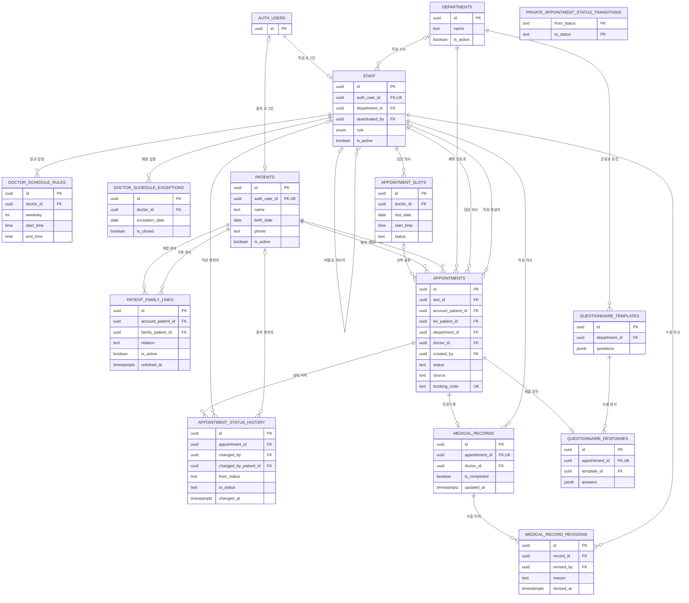
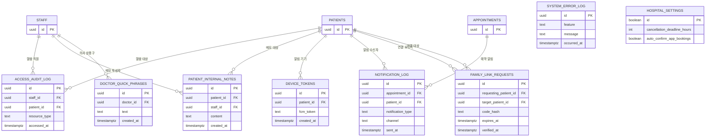
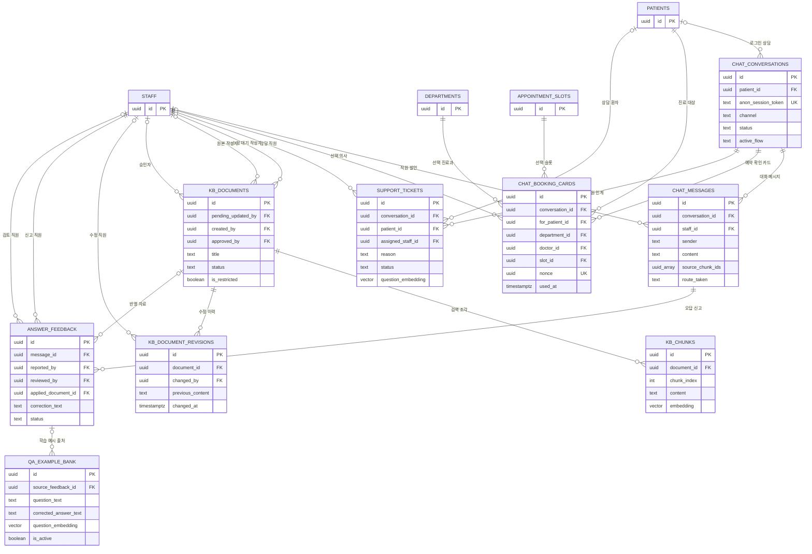

# Supabase 계획 스키마 ERD

작성일: 2026-07-28  
기준 문서: `docs/superpowers/plans/2026-07-27-*.md`의 `CREATE TABLE`, `ALTER TABLE ... ADD COLUMN`, 외래키 선언  
연결 보고서: `docs/supabase-postgres-review-2026-07-28.md`

## 1. 읽는 방법

ERD(Entity Relationship Diagram, 개체 관계도)는 “어떤 테이블이 어떤 테이블을 참조하는지” 보여주는 지도다.

- `PK`: Primary Key, 각 행을 구별하는 기본키
- `FK`: Foreign Key, 다른 테이블 행을 가리키는 외래키
- `UK`: Unique Key, 중복을 허용하지 않는 값
- `||`: 반드시 1개
- `o|`: 없거나 1개
- `o{`: 없거나 여러 개

이 문서는 아직 만들어지지 않은 실제 DB가 아니라 **계획서에 적힌 예정 스키마**를 표현한다. 계획서 수정 과정에서 테이블이나 관계가 달라지면 ERD도 함께 갱신해야 한다.

계획된 애플리케이션 테이블은 총 31개다.

| 영역 | 테이블 수 | 주요 테이블 |
|---|---:|---|
| 기반·예약·진료 | 18 | `staff`, `patients`, `appointments`, `medical_records` |
| 직원 웹 추가 | 1 | `doctor_quick_phrases` |
| 환자 앱 추가 | 3 | `device_tokens`, `notification_log`, `family_link_requests` |
| AI 챗봇 추가 | 9 | `chat_*`, `kb_*`, `support_tickets`, `answer_feedback` |

`auth.users`는 Supabase가 제공하는 인증 테이블이라 31개에 포함하지 않았다.

## 2. 인증·직원·환자·예약·진료 ERD



`private.appointment_status_transitions`는 다른 테이블과 외래키로 연결되지 않은 내부 상태 규칙표다. `from_status`와 `to_status`는 모두 `NOT NULL`이며, 예약 생성의 최초 상태는 이 표에 `NULL` 행으로 넣지 않는다. 일반 사용자 세션에는 표 권한을 주지 않고 `SECURITY DEFINER` 트리거만 허용된 상태 이동을 검사할 때 읽는다.

## 3. 운영·감사·환자 앱 ERD



`system_error_log`와 `hospital_settings`는 현재 계획에서 다른 테이블을 참조하지 않는 독립 테이블이다. `hospital_settings`는 `id = true` 한 행만 두는 싱글턴(singleton, 설정 한 묶음만 저장하는 방식)이다.

## 4. AI 상담·지식자료 ERD



## 5. ERD 작성 중 추가로 확인된 관계 문제

### ERD-01. 가족이 자기 자신을 가족으로 연결할 수 있다

`patient_family_links`에는 `(account_patient_id, family_patient_id)` UNIQUE만 있고 두 값이 달라야 한다는 CHECK가 없다.

권장 제약:

```sql
check (account_patient_id <> family_patient_id)
```

### ERD-02. 상태 이력에 직원과 환자 행위자가 동시에 들어갈 수 있다

환자 앱 계획의 제약은 `changed_by is not null or changed_by_patient_id is not null`이라 둘 중 하나 이상만 요구한다. 두 값이 모두 채워진 모순된 이력도 허용한다.

직원 또는 환자 중 정확히 한 명만 허용한다면 다음과 같은 XOR(둘 중 정확히 하나) 조건이 필요하다.

```sql
check ((changed_by is null) <> (changed_by_patient_id is null))
```

향후 시스템 행위자를 추가한다면 `actor_type`, `actor_id` 구조로 다시 설계하는 편이 명확하다.

### ERD-03. 지식자료만 `ON DELETE CASCADE`를 사용한다

`kb_chunks.document_id`, `kb_document_revisions.document_id`는 `ON DELETE CASCADE`다. 상위 `kb_documents`가 삭제되면 조각과 수정이력이 실제 삭제되어 “업무 테이블은 소프트 삭제하고 과거 이력을 보존한다”는 전역 원칙과 충돌한다.

권장 수정:

- `kb_documents.status = 'archived'`로 보관한다.
- 애플리케이션 역할의 DELETE 권한을 제거한다.
- 수정이력에는 `ON DELETE CASCADE`를 사용하지 않는다.

### ERD-04. `chat_messages.source_chunk_ids`는 실제 외래키가 아니다

PostgreSQL의 UUID 배열은 각 원소를 `kb_chunks(id)` 외래키로 선언할 수 없다. 현재 구조에서는 지식 조각이 바뀌거나 없어져도 메시지의 출처 ID가 유효한지 DB가 보장하지 않는다.

출처 추적이 감사상 중요하다면 다음 연결 테이블을 권장한다.

```text
chat_message_sources(
  message_id -> chat_messages.id,
  chunk_id -> kb_chunks.id,
  similarity,
  displayed_order
)
```

단, 승인 자료를 재생성할 때 과거 조각까지 보존한다면 UUID 배열을 스냅샷으로 유지하는 선택도 가능하다. 어느 방식을 쓸지는 “과거 AI 답변의 근거를 나중에도 재현해야 하는가”를 기준으로 결정한다.

### ERD-05. 의사 정규 일정의 자연키와 시간 제약이 없다

한 의사는 같은 요일에 하나의 정규 규칙만 갖는 서비스 로직인데 `doctor_schedule_rules`에는 `(doctor_id, weekday)` UNIQUE가 없다. 또한 시작·종료시간, 슬롯 길이, 최대 예약 수의 유효 범위를 DB가 보장하지 않는다.

권장 제약:

```sql
unique (doctor_id, weekday)
check (start_time < end_time)
check (slot_duration_minutes > 0)
check (max_appointments_per_slot > 0)
```

점심시간은 시작과 종료가 둘 다 NULL이거나 둘 다 존재하며 `lunch_start < lunch_end`가 되도록 별도 CHECK가 필요하다.

### ERD-06. 같은 기기 토큰을 여러 환자가 소유할 수 있다

`device_tokens`의 UNIQUE가 `(patient_id, fcm_token)`이라 같은 `fcm_token`이 여러 환자 행에 들어갈 수 있다. 기기 양도·로그아웃 후 이전 계정의 의료 알림이 새 사용자 기기에 전달되는 일을 막으려면 토큰 자체를 전역 UNIQUE로 두고 등록 시 소유자를 원자적으로 이전해야 한다.

### ERD-07. 상태전이 규칙표 권한 경계 — 현재 계획에서 해결됨

초기 검토에서는 `appointment_status_transitions`가 공개 스키마에 있고 RLS도 없어 일반 역할이 규칙을 조작할 위험이 있었다. 현재 계획은 SDB-02와 SDB-17을 반영해 다음과 같이 수정됐다.

- 표를 `private.appointment_status_transitions`로 이동한다.
- `from_status`와 `to_status`를 모두 `NOT NULL` 복합 PK로 사용한다.
- 최초 예약 상태를 뜻하는 `NULL` 규칙 행은 넣지 않는다.
- 일반 사용자에게 표 권한을 주지 않고 `SECURITY DEFINER` 상태전이 트리거만 읽게 한다.

따라서 이 항목은 더 이상 미해결 ERD 문제가 아니며, 실제 구현 후 일반 역할의 직접 SELECT·INSERT가 거부되는지 테스트해야 한다.

## 6. ERD 갱신 규칙

- 마이그레이션에서 테이블·외래키·UNIQUE 관계를 바꾸면 같은 커밋에서 ERD도 수정한다.
- 실제 마이그레이션 구현 후 Supabase가 인식한 스키마와 이 문서를 한 번 대조한다.
- ERD는 권한을 보여주지 않으므로 RLS 안전성은 별도 검토 보고서와 역할별 테스트로 확인한다.
